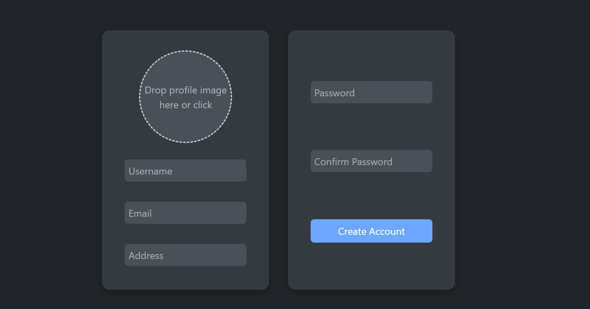
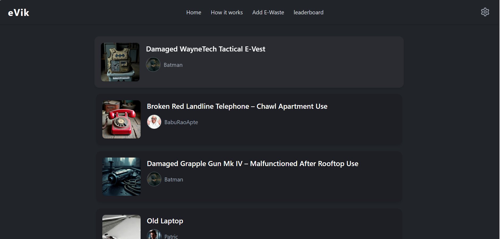
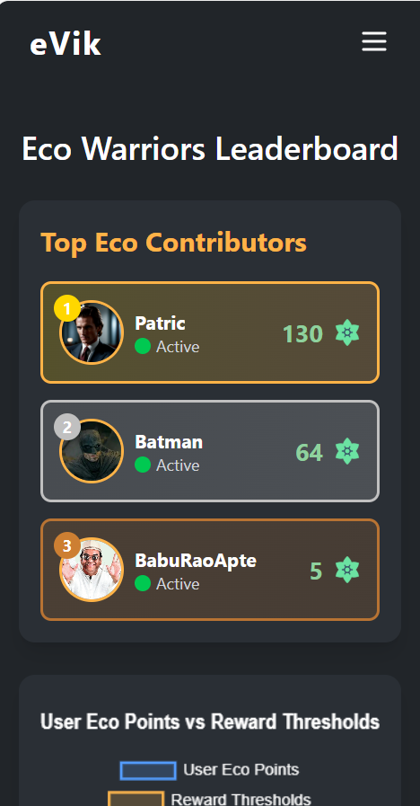
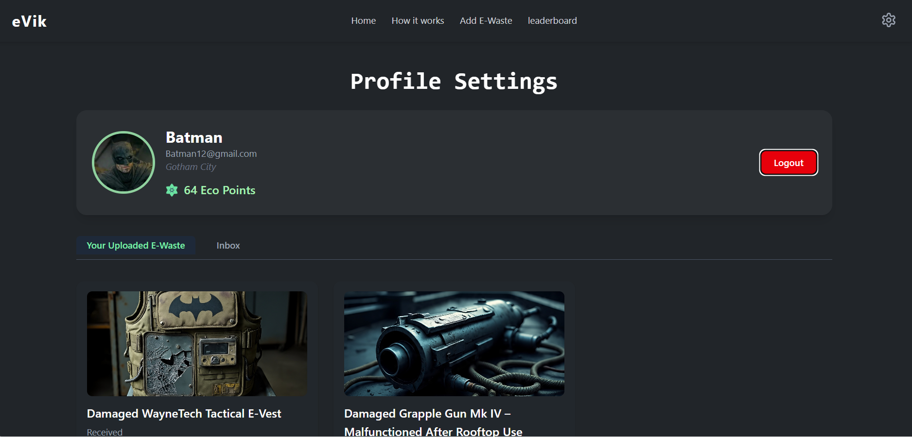
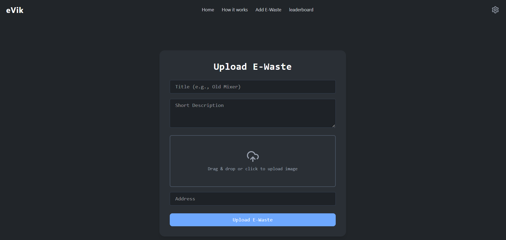
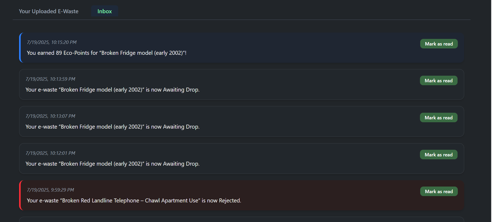

# 🌍 eVik – Recycle to Revive

> "What we throw away today shapes the world we leave for tomorrow."

**eVik** is not just a tech project — it's a movement.  
Built with heart and code, eVik empowers everyday people to turn electronic waste into a tool for environmental healing. Through simple actions — uploading, recycling, and rewarding — **we create ripples of impact that preserve the planet.**


---

## 🌱 Why eVik?

Every broken phone, outdated laptop, or forgotten charger has a story — and a consequence.

Mountains of e-waste fill landfills every year, leaking toxins into soil, water, and air. But it doesn’t have to be this way.

**eVik** is a call to action.  
A platform where you can say:  
**"I choose to be part of the solution."**

---

## 💚 What You Can Do

### 🔹 Upload E-Waste  
Give your old electronics a dignified end — recycle them responsibly.

### 🟢 Earn EcoPoints  
Get rewarded for helping the planet. Track your impact through our point system.

### 🏆 Compete for Good  
Join the **Eco Leaderboard** and show the world your commitment to sustainability.

### 🎁 Redeem & Reinvest  
Trade EcoPoints for useful rewards — because doing good should feel good too.

---

## 🧠 How It Works


1. **Register & Join**  
   Become a part of our eco-warrior community. Track your uploads, points, and rank.

2. **Upload E-Waste**  
   Add your old devices and describe their condition — we’ll handle the rest.

3. **Verification**  
   We assess recyclability and approve the submission.

4. **Earn EcoPoints**  
   Accepted items grant points. More items = more impact.

5. **Redeem Rewards**  
   EcoPoints can be exchanged for cool, eco-friendly items.

6. **Rise on the Leaderboard**  
   See how your efforts compare and inspire others to rise too.

---

## 🖼 User Experience Preview

### 🔐 Registration Page  
Create your profile and drop in with purpose.  


### 🏠 Home (Uploaded E-Waste Feed)  
See what others are recycling — join the green wave.  


### 📊 Leaderboard  
Celebrate eco-heroes across the community.  


### ⚙️ Profile & Points  
Track your uploads, rewards, and earned EcoPoints.  


### 🗑 Upload E-Waste  
Drag, drop, and make a difference.  


### 💌 Inbox Notifications  
Get real-time updates when your e-waste is verified, rejected, or rewarded.  


---

## ⚙️ Built With

- **React.js** – Fast and responsive UI
- **Tailwind CSS** – Sleek dark theme and mobile-friendly layouts
- **React Router** – Seamless page transitions
- **Context API** – Smart state management
- **Chart.js** – Beautiful data visualizations
- **Axios** – Secure backend communication

---

## 📦 Getting Started

```bash
# Clone the repository
git clone https://github.com/SahilKaturde/e-vik-frontend.git

# Move into the project folder
cd e-vik-frontend

# Install dependencies
npm install

# Start the development server
npm start
