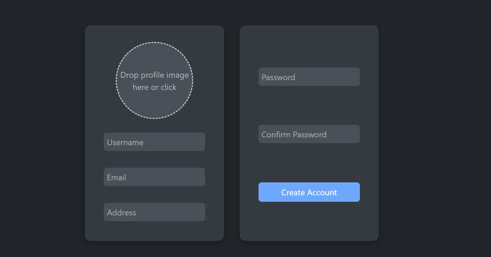
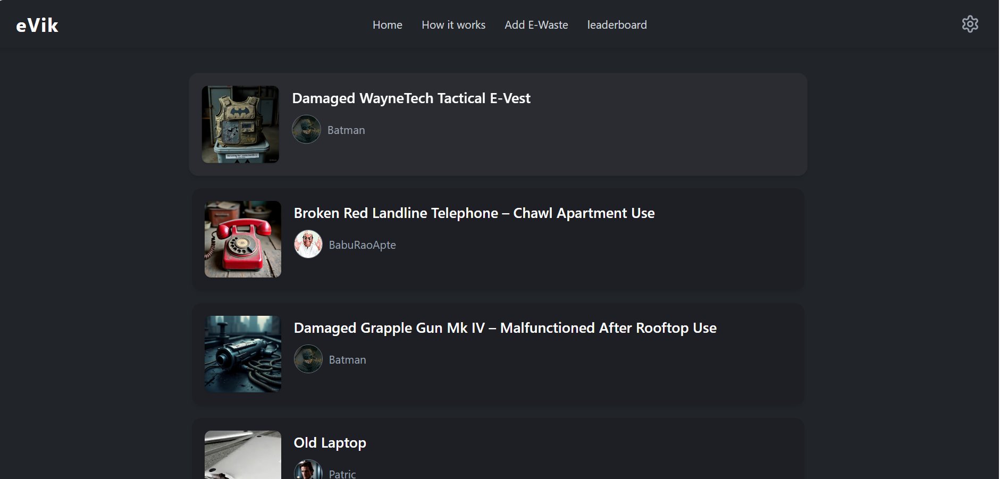
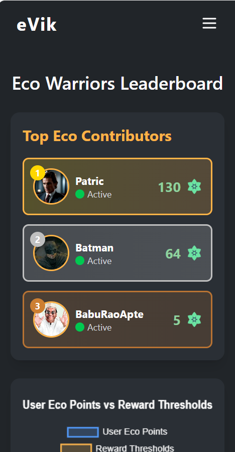
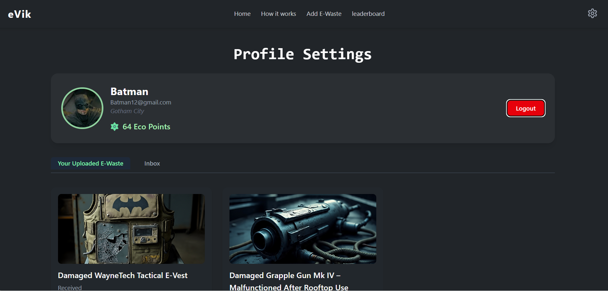
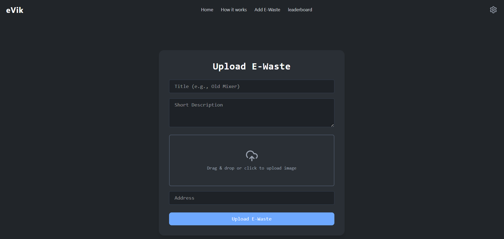

# React + Vite

This template provides a minimal setup to get React working in Vite with HMR and some ESLint rules.

Currently, two official plugins are available:

- [@vitejs/plugin-react](https://github.com/vitejs/vite-plugin-react/blob/main/packages/plugin-react) uses [Babel](https://babeljs.io/) for Fast Refresh
- [@vitejs/plugin-react-swc](https://github.com/vitejs/vite-plugin-react/blob/main/packages/plugin-react-swc) uses [SWC](https://swc.rs/) for Fast Refresh

## Expanding the ESLint configuration

If you are developing a production application, we recommend using TypeScript with type-aware lint rules enabled. Check out the [TS template](https://github.com/vitejs/vite/tree/main/packages/create-vite/template-react-ts) for information on how to integrate TypeScript and [`typescript-eslint`](https://typescript-eslint.io) in your project.


# 🌱 eVik – E-Waste Management Frontend

eVik is a web-based platform that empowers users to recycle electronic waste responsibly. Users can upload old electronics, earn EcoPoints, and redeem them for rewards. The frontend is built using **React.js**, styled with modern dark UI, and supports interactive user features like profiles, leaderboards, and image uploads.



---

## 🧠 How It Works


1. **Register & Join**  
   Create an account to join the e-waste warrior community.

2. **Upload E-Waste**  
   Submit broken or unused electronic items for pickup and evaluation.

3. **Verification**  
   Items are reviewed for recyclability.

4. **Earn EcoPoints**  
   Get rewarded for accepted uploads.

5. **Redeem Rewards**  
   Exchange EcoPoints for cool items and discounts.

6. **Leaderboard**  
   Track your contributions and compete for top ranks.

---

## 🖼 App Screenshots

### 🔐 Registration Page


### 🏠 Home Page (Uploaded Items)


### 📊 Leaderboard


### ⚙️ Profile Settings


### 🗑 Upload E-Waste


---

## 📁 Project Structure

```bash
e-vik-frontend/
│
├── public/
│   ├── Capture.PNG
│   ├── homepage.PNG
│   ├── How it work.PNG
│   ├── leaderboard.PNG
│   ├── logo.PNG
│   ├── profile.PNG
│   └── upload.PNG
│
├── src/
│   ├── components/
│   ├── pages/
│   ├── App.jsx
│   └── index.js
│
├── package.json
└── README.md
